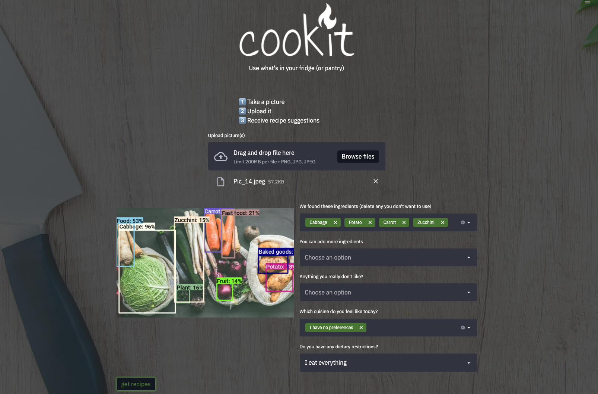

[](https://cookit-frontend.herokuapp.com/)


# cookit_frontend

This is the Streamlit frontend app for [cookit](https://github.com/csseries/cookit). A user may upload an image of certain food ingredients and a Deep Learning Model will apply object-detection to predict a list of ingredients which are found on the image. The user can than edit and extend ingredients to find recipes which make the most of available ingredients.

The app is running on https://cookit-frontend.herokuapp.com/





# Installation

Get the project
```bash
# Either
git clone git@github.com:csseries/cookit_frontend.git

# Or
git clone https://github.com/csseries/cookit_frontend.git
```

Create virtualenv and install the project:
```bash
sudo apt-get install virtualenv python-pip python-dev
deactivate; virtualenv ~/venv ; source ~/venv/bin/activate ;\
    pip install pip -U; pip install -r requirements.txt
```


# Run the frontend
Run the frontend
```bash
# Will run the streamlit app locally with a local backend, expected on http://localhost:8080
make streamlit

# Will run the streamlit app locally but sending requests to deployed backed on Google Cloud
streamlit run app.py
```

# Acknowledgement
This project was made within the scope of a [Le Wagon](https://www.lewagon.com/) Data Science bootcamp, batch #674 in Munich. 🚌

## Made with  ❤️  by
- [Claire-Sophie Sériès](https://github.com/csseries)
- [Justin Bruce Sams](https://github.com/JustinSms)
- [Lilly Kämmerling](https://github.com/lillykml)
- [Judith Reker](https://github.com/judd-r)
- [Michael Weitnauer](https://github.com/kickermeister)
